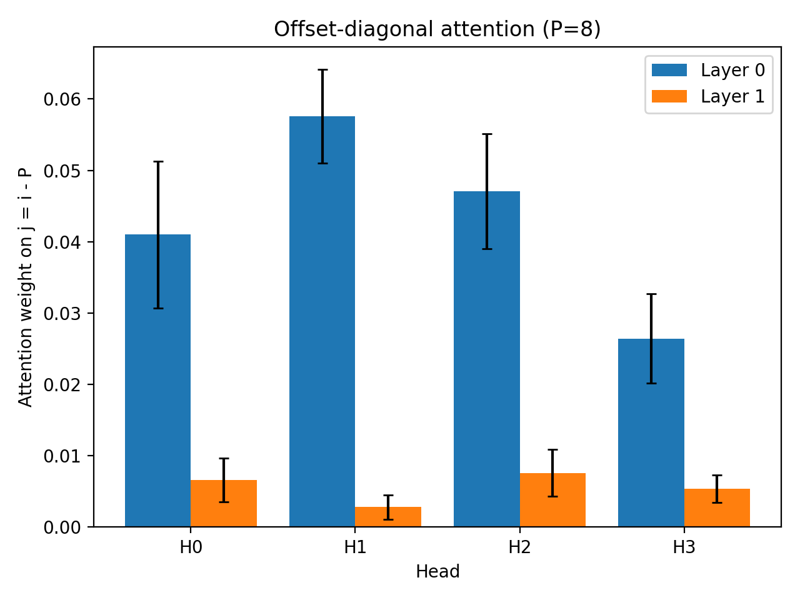
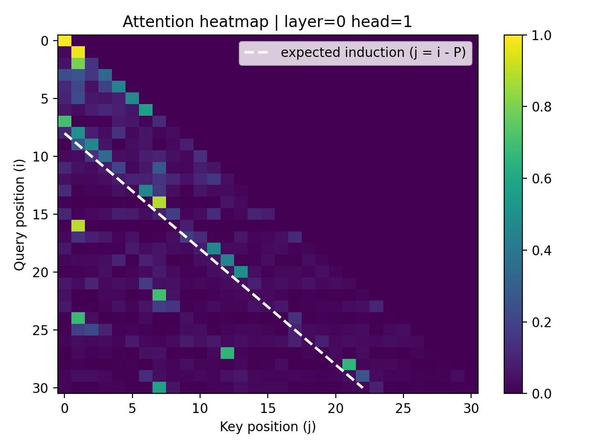
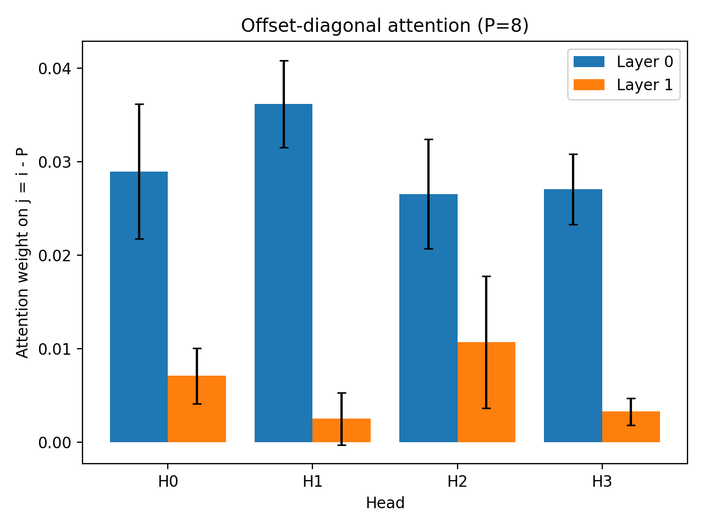

# Tiny Transformer Mechanistic Interpretability

This project investigates how a small transformer solves a synthetic periodic induction task.
Although the trained model achieves perfect predictive accuracy on repeated sequences,
mechanistic probes and targeted interventions reveal that the model does **not** learn a
canonical induction head. Instead, the network exploits a **position‑dependent shortcut**
enabled by positional embeddings.

The repository contains the full experimental pipeline:

- Transformer training
- Quantitative evaluation
- Mechanistic probing
- Attention visualisation
- Controlled interventions

The goal is to demonstrate how **mechanistic interpretability methods can diagnose the
internal strategies used by neural networks**, even when behavioural performance appears correct.

## Full Report

[Open the PDF report](report/main.pdf)

<object data="report/main.pdf" type="application/pdf" width="100%" height="800">
  <p>Please click on the above to read the report.</p>
</object>

---

# 1. Overview

Transformers trained on repeated‑sequence tasks are often expected to develop **induction heads**
— attention circuits that copy tokens from previous occurrences.

However, successful task performance does **not guarantee that the intended algorithmic mechanism
has emerged**.

This project trains a small decoder‑only transformer on a synthetic periodic sequence task and
then uses **attention probing and targeted interventions** to analyse how the model actually
solves the task.

Despite achieving perfect prediction accuracy in the repeated region of the sequence, the model
**does not develop a clean induction circuit**. Instead, it relies on a **position‑dependent
shortcut strategy** supported by diffuse, recency‑biased attention patterns.

---

# 2. Research Question

The central research question explored in this project is:

**Does a transformer trained on a periodic sequence prediction task learn a canonical induction
circuit, or does it exploit alternative shortcut strategies?**

Key investigation points:

- Does attention concentrate on the **expected induction offset** $(j = i − P)$?
- Are predictions driven by **token matching** or **positional structure**?
- How does the model respond to targeted perturbations of sequence structure?

---

# 3. Experimental Setup

### Synthetic Dataset

Sequences consist of a repeating pattern:

[A B C D E F G H A B C D E F G H ...]

Dataset parameters:

- Vocabulary size: 20
- Pattern length: 8
- Sequence length: 32
- Batch size: 64

The model is trained using **autoregressive next‑token prediction**.

### Model Architecture

Decoder‑only Transformer:

- 2 layers
- 4 attention heads
- Hidden dimension: 64
- MLP dimension: 256
- Learned token embeddings
- Learned positional embeddings

Training runs for **2000 optimisation steps**.

### Evaluation Metrics

Performance is measured across two regions:

**Early region**  
Positions before the full pattern has been observed.

**Induction region**  
Positions where the repeated pattern makes the next token deterministic.

---

# 4. Mechanistic Analysis

To determine how the model solves the task, several interpretability probes are applied.

### Offset‑Diagonal Probe

A canonical induction head attends strongly to:

$j = i − P$

where **P** is the pattern length.

The average attention weight assigned to this offset diagonal is measured across all heads
and layers.

### Argmax Attention Probe

For each query position, the key position receiving the **highest attention weight** is recorded.

This identifies whether attention consistently targets the expected induction offset.

### Attention Heatmaps

Attention matrices are visualised for individual heads to examine the qualitative structure of
attention patterns.

These visualisations help determine whether the model forms a **clean induction diagonal**
or instead uses broader contextual attention.

---

# 5. Key Findings

### 1. Perfect task performance does not imply an induction circuit

The model achieves **~100% accuracy in the induction region**, yet attention probes reveal
**weak offset‑diagonal attention**.

### 2. Attention patterns are diffuse and recency‑biased

Rather than focusing sharply on the previous occurrence of a token, attention maps display
**smooth gradients over earlier tokens**.

### 3. Positional information is critical

Removing positional embeddings causes predictive performance to collapse to
**near‑random accuracy**.

### 4. The model exploits a positional shortcut

Sequence phase rotations and prefix perturbations show that the model relies on
**positional structure rather than token‑copying behaviour**.

---

# 6. Figures / Attention Maps

Example attention visualisations generated during analysis.

### Offset‑Diagonal Attention
<figure>
    
    <figcaption>Shows the average attention weight assigned to the expected induction offset.</figcaption>
</figure>

### Attention Heatmap
<figure>
    
    <figcaption>Example attention matrix for a single head.</figcaption>
</figure>

### Prefix Intervention Analysis
<figure>
    
    <figcaption>Attention statistics after prefix perturbation.</figcaption>
</figure>

---
These figures illustrate the absence of a clear induction diagonal and the presence of
**recency‑biased attention patterns**.

---

# 7. Repository Structure

```text
.
├── README.md
├── LICENSE
├── pyproject.toml
├── dummy.py
├── src/
│   ├── __init__.py
│   ├── config.py
│   ├── data.py
│   ├── model.py
│   ├── seed_utils.py
│   ├── train.py
│   ├── eval.py
│   ├── mech_interp.py
│   └── viz.py
├── checkpoints/
│   └── baseline.pt
├── artifacts/
│   ├── exp_0/
│   ├── exp_1/
│   ├── exp_2/
│   └── exp_3/
├── mech_viz/
│   ├── exp_0_viz_seed_0/
│   ├── exp_1_viz_seed_0/
│   ├── exp_2_viz_seed_0/
│   └── exp_3_viz_seed_0/
├── report/
│   ├── main.pdf
│   └── images/
└── wandb/
    └── run-*/  (experiment logs and metadata)
```

---

# Tools Used

- PyTorch
- Matplotlib
- Weights & Biases

---

# Motivation

This project demonstrates that **behavioural evaluation alone is insufficient for understanding
neural networks**.

Even simple tasks can be solved through unintended shortcut strategies. Mechanistic
interpretability methods provide the tools needed to diagnose these behaviours and
understand how models actually compute.
